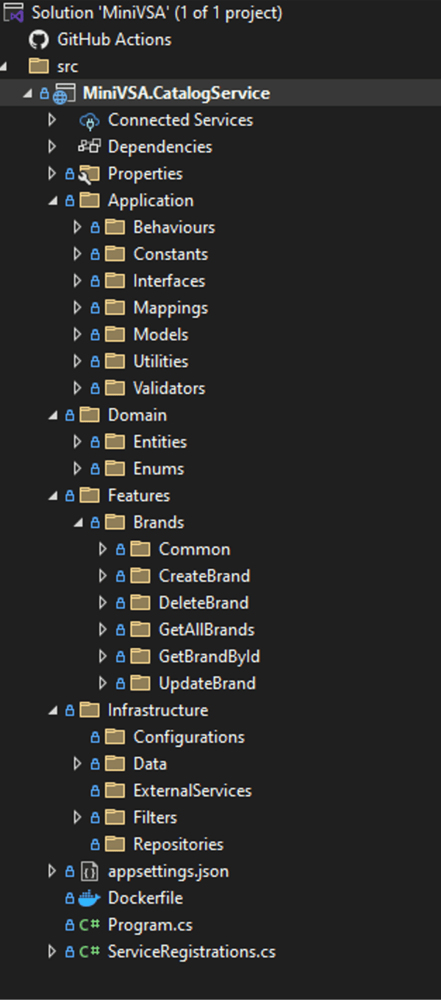
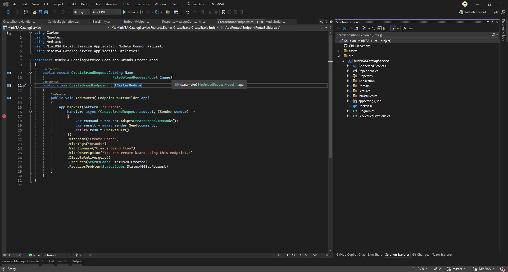

# MiniVSA
A Vertical Slice Architecture template that is fully developed with endpoints structured using Minimal API!

## Give a Star ⭐
If you find this MiniVSA project valuable and believe in the synergy of Minimal API + Vertical Slice Architecture, consider showing your valuable support by giving this repository a star!
 
## Getting Started

This repository provides a template to professionally build your Minimal API + VSA application as follows:

### Features
- [x] Brands
  - [x] CreateBrand
  - [x] DeleteBrand
  - [x] GetAllBrands 
  - [x] GetBrandById
  - [x] UpdateBrand
     
## Demo

